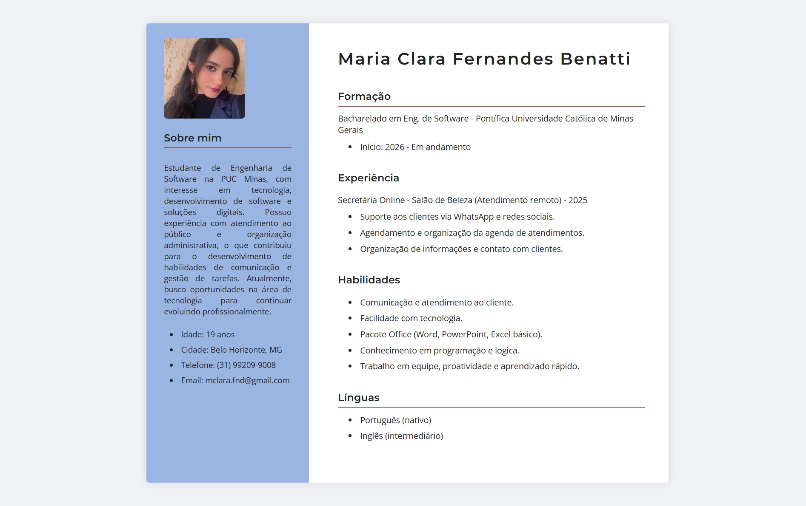

# Trabalho Prático - Semanas 3 e 4

## Informações Gerais
- Nome: Maria Clara Fernandes Benatti
- Matricula: 910356

## Print da tela da página criada (Curriculum Vitae)

[Curriculum](tp-2-mclarafnd/imagemcurriculum.jpeg)
